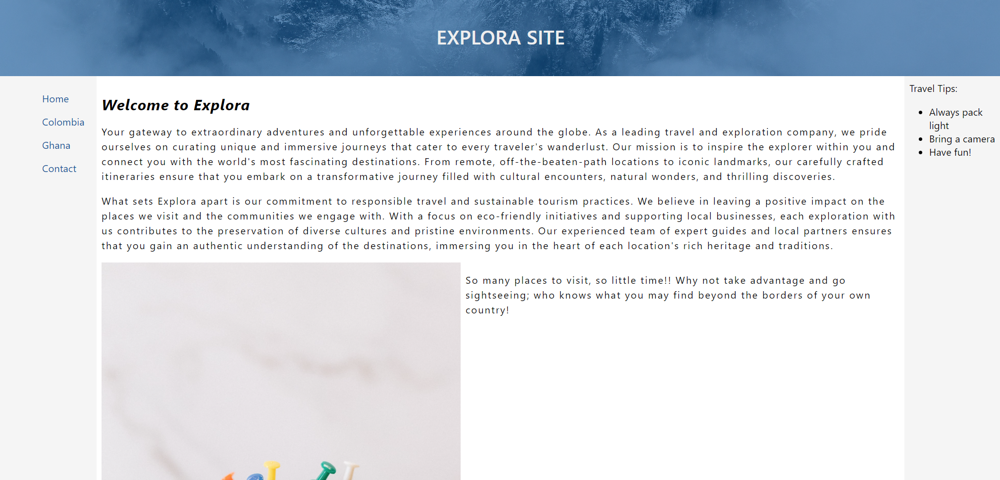
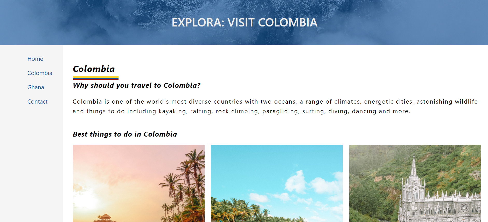
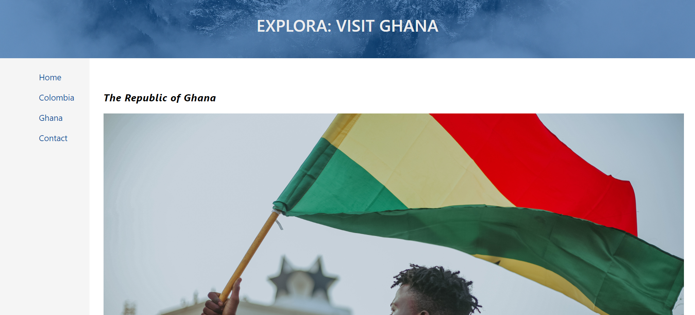
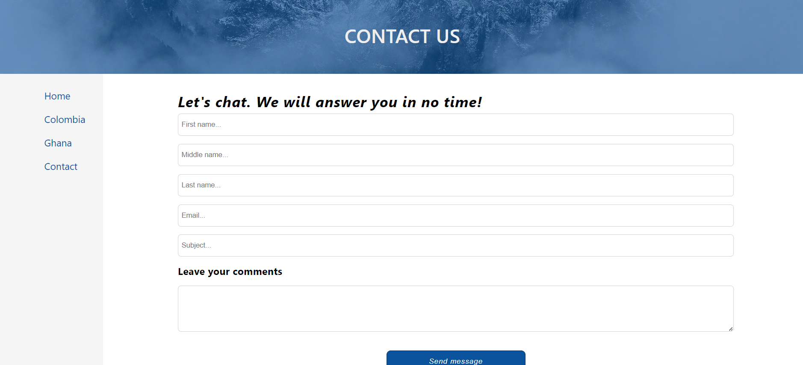

# ✈️ Explora

## 📌 Project Overview

**Explora** is a tourism-based website designed to provide insights into various destinations. The site includes information about different countries, travel tips, and a contact page for inquiries. It was developed as a **final college project in pairs**, with my main contributions focused on the **Home page** and **Colombia information page**.

---

## 🌍 Live Demo

🌎 **Try it out here**: [Explora Live Demo](https://explora-henna.vercel.app)

---

## 🚀 Features

- 🏡 **Home Page**: Introduction to Explora and the purpose of the website.
- 🌎 **Colombia Page**: Highlights Colombia’s best attractions, cities, and cultural experiences.
- 🌍 **Ghana Page**: Provides details on Ghana’s tourism hotspots.
- 💌 **Contact Page**: Allows visitors to send inquiries.
- 📱 **Responsive Design**: Works across different screen sizes.

---

## 🛠 Technologies Used

- **🌐 HTML5**: Structure of the website.
- **🎨 CSS3**: Styling and layout.
- **📱 Responsive Design**: Ensures compatibility across devices.

---

## 📌 Project Purpose

This project demonstrates:

- **Web Development Skills:** Creating a structured, well-designed website using HTML and CSS.
- **User Experience (UX) Focus:** Providing an intuitive navigation system and engaging content.
- **Tourism Promotion:** Showcasing destinations with compelling visuals and useful travel insights.
- **Responsive Design Implementation:** Ensuring accessibility across different screen sizes.
- **Collaborative Work:** Working in pairs to divide responsibilities and ensure project consistency.

---

## 📂 Project Structure

```
📝 explora_project
 ├── 📝 images/            # Contains all images used in the site
 ├── 📝 pages/             # Individual country pages and contact page
 │   ├── colombia.html     # Colombia information page (My contribution)
 │   ├── ghana.html        # Ghana information page
 │   ├── contact-us.html   # Contact page
 ├── 📝 styles/            # CSS files for styling
 │   ├── style.css         # Main stylesheet
 ├── 📝 index.html         # Homepage (My contribution)
```

---

## 📌 Prerequisites

To view the website, ensure you have:
- A modern web browser (Chrome, Firefox, Edge, etc.).

---

## 🏃‍♂️ How to View the Website

1️⃣ Open `index.html` in a web browser.

2️⃣ Navigate through the site using the menu.

---

## 🎯 My Contribution

For this project, I was responsible for developing:

- **Homepage (`index.html`)**: Designed the main structure, introduction, and travel insights.
- **Colombia Page (`colombia.html`)**: Created content showcasing the country's attractions and culture.
- **Ensured a consistent and visually appealing design across pages.**

---

## 🖼 Screenshots

| Home | Colombia |
|------------|---------|
|  |  |

| Ghana | Contact Us |
|------------|---------|
|  |  |

---

## 📝 License

This project was developed for educational purposes as part of a **final college assignment**.

---

## 💼 Author

👤 **Juan Jacobo Florez Monroy**  
🌐 **Portfolio**: [jjacobo95.com](https://jjacobo95.com)  
🐙 **GitHub**: [github.com/jjacoboflorez95](https://github.com/jjacoboflorez95)